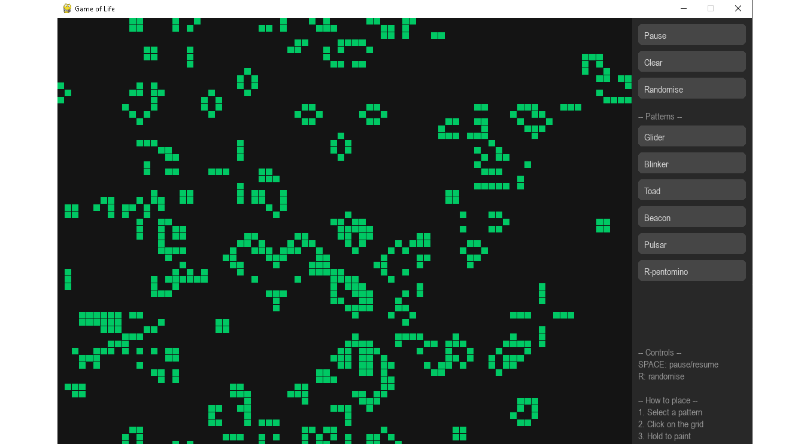
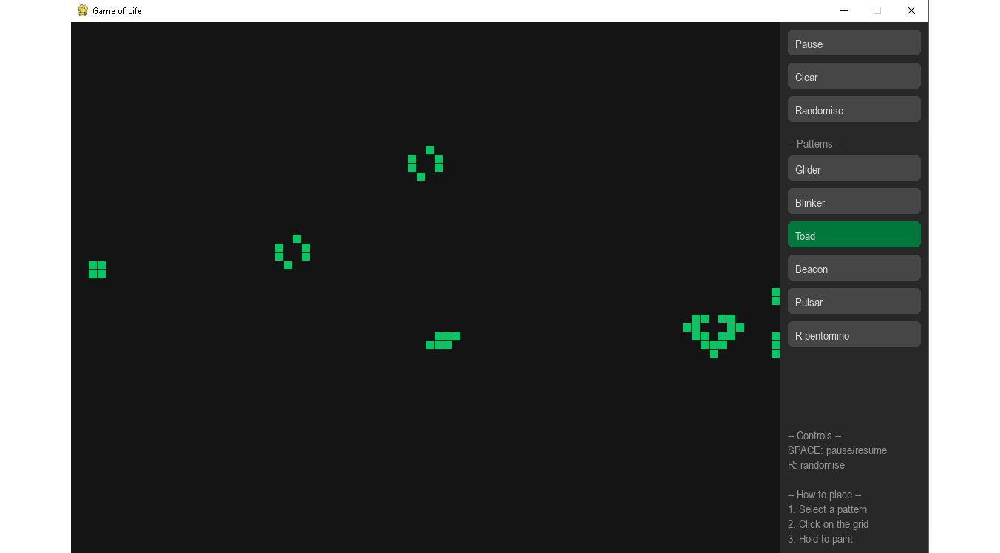
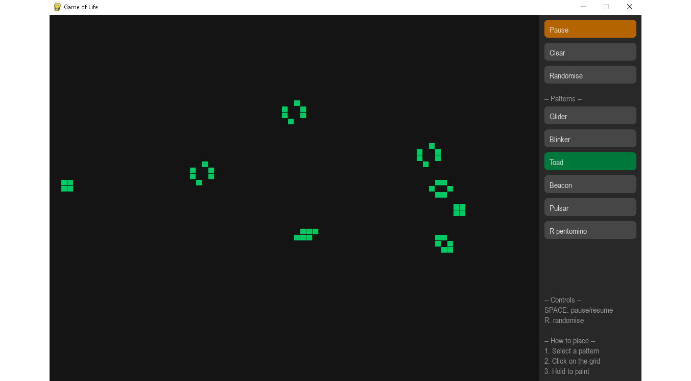
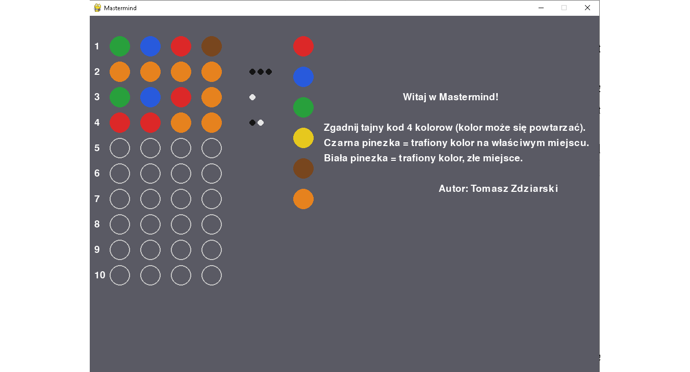
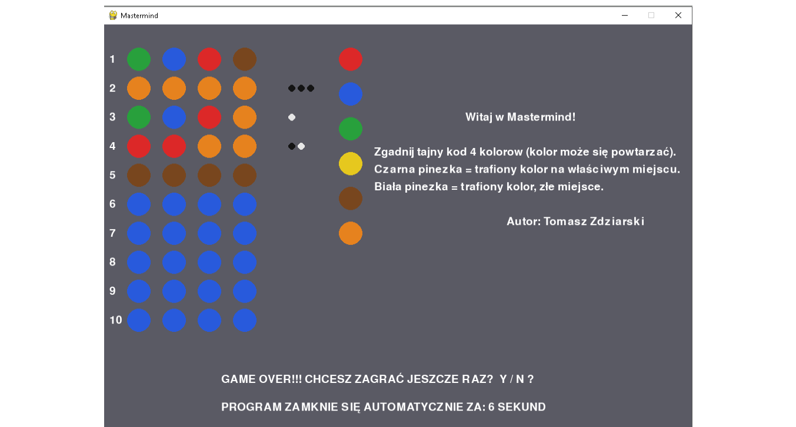
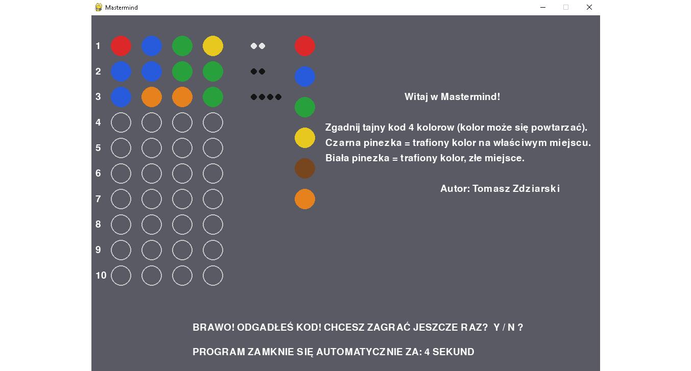

# Python Mini Games

A collection of small Python games, built to practice core programming concepts: recursion, state machines, event-driven programming, and object-oriented refactoring.

👤 **Author:** [Tomasz Zdziarski](https://github.com/TomaszZdziarski)


## Projects

| Game | Folder | Highlights |
|---|---|---|
| [Game of Life](#game-of-life-conways-game-of-life) | `game-of-life/` | Cellular automaton, toroidal grid, Pygame UI |
| [Mastermind](#mastermind) | `mastermind/` | Event loop, click detection, scoring algorithm |
| [Minesweeper](#minesweeper-saper) | `minesweeper/` | Recursion, state machine, OOP refactor |
| [Rock-Paper-Scissors-Lizard-Spock](#rock-paper-scissors-lizard-spock) | `rock-paper-scissors/` | Algorithmic logic, input validation |

---

## Game of Life (Conway's Game of Life)

A Pygame implementation of Conway's cellular automaton, with a toroidal (wrapping) grid, a side panel UI, and a library of classic patterns.

**Features:**
- Toroidal grid — cells wrap around the edges instead of dying at the border
- Buffer-swap update logic to apply all four Game of Life rules simultaneously each generation
- Side panel with a pattern selector (Glider, Blinker, Toad, Beacon, Pulsar, R-pentomino)
- Click-to-paint cells directly on the grid

**Screenshots:**




**Run it:**
```bash
cd game-of-life
python main.py
```

---

## Mastermind

The classic code-breaking game, with a graphical Pygame interface built on top of a working console version.

**Features:**
- Full event loop handling mouse clicks and keyboard input
- Click detection via distance-based collision on the color palette
- Scoring algorithm for guesses (black/white pins)
- Win/loss end screen with an auto-close timer

**Screenshots:**




**Run it:**
```bash
cd mastermind
python mastermind.py
```

---

## Minesweeper (Saper)

A from-scratch implementation of classic Minesweeper logic, refactored from a procedural script into an object-oriented `Saper` class.

**Features:**
- Recursive flood fill to reveal empty regions
- Cell state machine for flags/question marks, matching classic Windows Minesweeper behavior
- Win-condition check via the "search for a counterexample" pattern
- `global_explained.py` — a small companion script documenting how Python's `global` keyword was used while building this

**Screenshots:**


_The graphical interface is still in progress — screenshots will be added once it's ready. The game logic itself (flood fill, flags, win condition) is complete and playable from the console._

**Run it:**
```bash
cd minesweeper
python saper.py
```

---

## Rock-Paper-Scissors-Lizard-Spock

A console game built around algorithmic thinking, input validation, and score tracking.

**Screenshots:**


_Currently a console game — a graphical version is planned._

**Run it:**
```bash
cd rock-paper-scissors
python paper_scissors_lizzard_spock.py
```

---

## Getting Started

```bash
git clone https://github.com/TomaszZdziarski/python-mini-games.git
cd python-mini-games
python -m venv venv
venv\Scripts\activate        # Windows
pip install -r requirements.txt
```

Each game lives in its own folder and can be run independently — see the "Run it" instructions above.

## License

These projects were built for educational and portfolio purposes.
